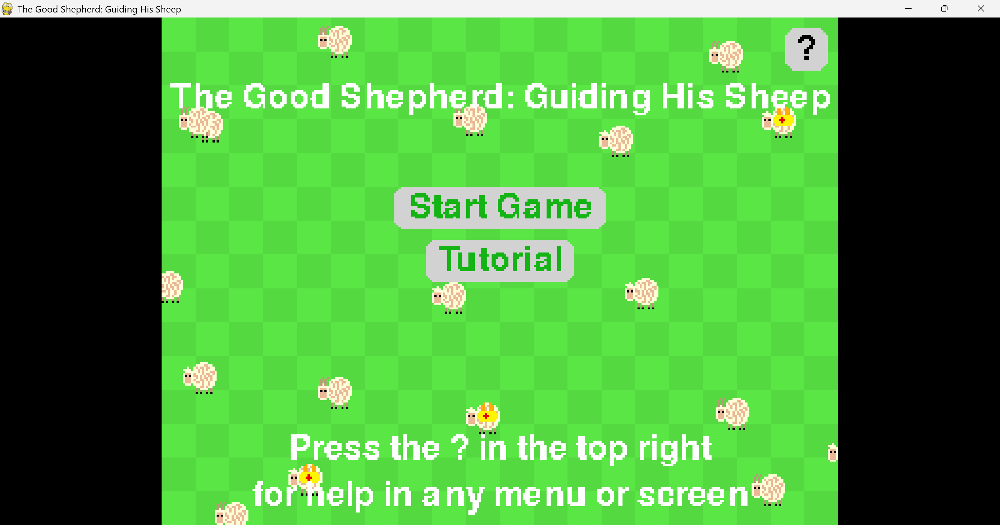
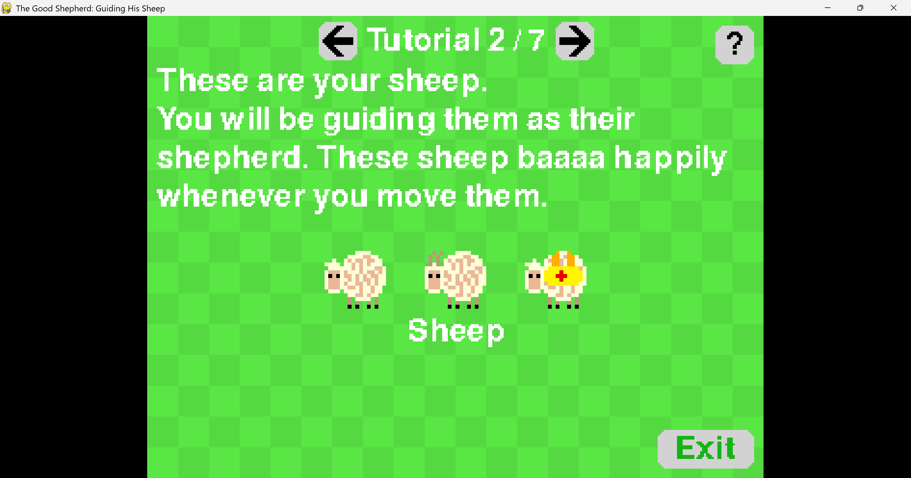
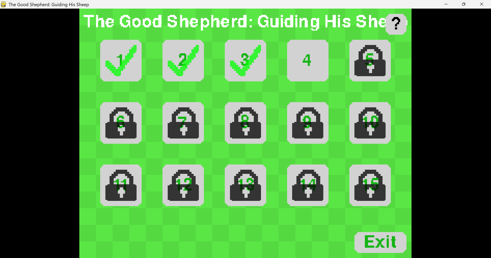
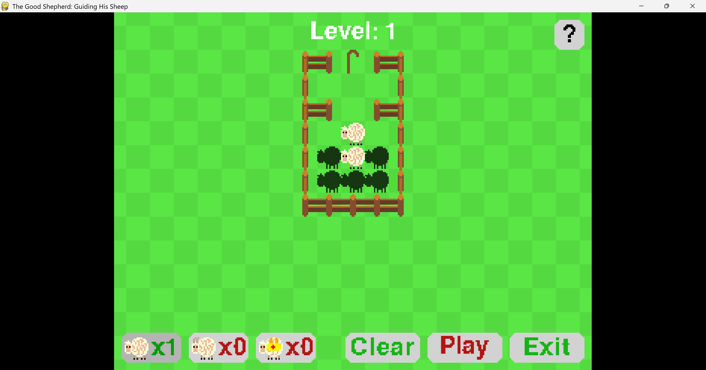
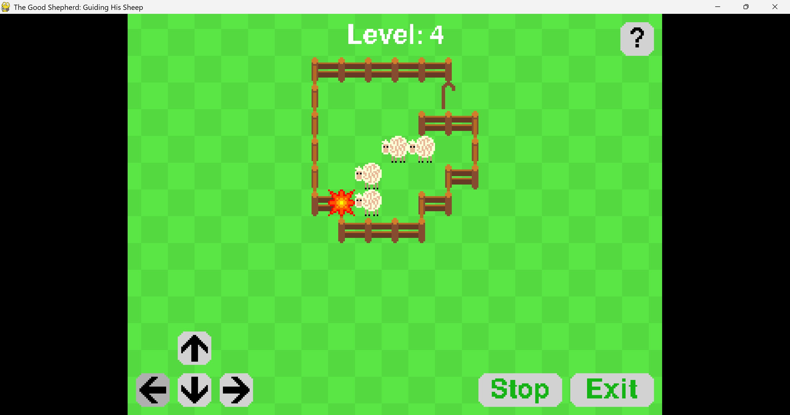

# The Good Shepherd: Guiding His Sheep
Guide your sheep to the staff.
To win, you need to get at least one of your sheep to the staff.

## Screenshots

Intro Screen

Following the tutorial

Selecting a level

Editing your formation

playing The Good Shepherd

## How to play
1. Download as zip here https://github.com/chain-linc/Final-Project/archive/refs/heads/main.zip
2. Extract zip file
3. Run main.py with pygame and python 3.10+
