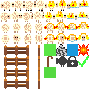

# Final Project
Final Project for HSC Programming Catholic Games with Python (2-D)

## Prototype
this game is currently a prototype and not the full game

^^^ This is my spritesheet i have made for the game it has all of the tiles i think are needed for the game

## How to play
click the help buttons in the game for how to play
